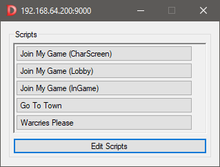
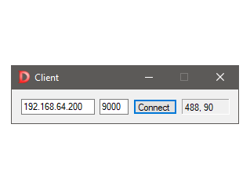
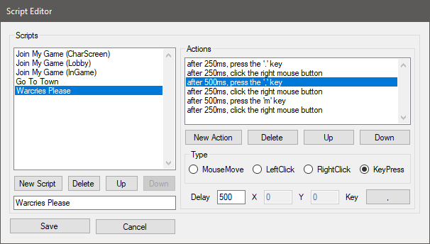

## D2RApp

 

### About

**IMPORTANT:** USING THIS APPLICATION ONLINE IS A BREACH OF BLIZZARDS CODE OF CONDUCT AND MAY RESULT IN YOUR ACCOUTS BEING BANNED, USE IT AT YOUR OWN RISK.

IT MIGHT BE FINE TO USE IN OFFLINE MODE BUT AT THE TIME OF WRITING THIS, i AM WAITING FOR CLARIFICATION FROM BLIZZARD.

D2RApp is a multiboxing application for Diablo II Ressurrected, which allows you to control multiple copies of the game client (running on different computers) using a single keyboard and mouse.

D2RApp is an application written in C# that enables the user to mirror MouseMove, MouseClick, and KeyPress input events from one master computer to multiple connected slave computers, where the input events are sent from the master to the slaves when the ALT key is being held down.

It might seem strange but this enables the user to be able to have two client copies of Diablo II Ressurrected running on two separate computers and be able to control both running clients with one keyboard and mouse.

Its all pretty basic but it meets my simple requirements and I thought I'd make it public just incase anyone else was looking for the same thing.

As well as being able to generate input events on slave computers, the master computer can also command slave computers to execute a script (a sequence of actions).

### What's New?

v1.0.1 (30 Mar 2023)

- Resolved numeric input crashes and strange behavior.
- Added status output to client.

v1.0.0 (29 Mar 2023)

- Initial public release.

### Installation

D2RApp is portable so just download the latest release and unzip it somewhere.

### Use

Start Diablo II Ressurrected on your master and slave computers.

Put your Diablo II Ressurrected computers into windowed mode (`ALT` + `ENTER`) and press `WINDOWS` + `ARROWUP` to make the program fill the screen properly in windowed mode (IMHO).

Start the `Server` application on your master computer, and run the `Client` application on all slave computers.

On each slave computer enter the IP Address and Port number of the master computer (which will be displayed in the Servers title bar), and click the `Connect` button.

When a slave computer connects to the server, the server will transmit the currently loaded scripts to that slave.

Once slaves are connected, you can mirror input events on all connected slave computers from the master computer when the `ALT` key is being held down.

*TIP* I hold the `SHIFT` key down when mirroring mouse clicks so that my character on my master computer does not walk off randomly when I want my character on the slave computer to move.

### Scripts

**Using Scripts...**

If you have created some scripts, they will be visible on the "Scripts" list in the main window. Clicking any of these buttons will cause that script to be executed on all connected slave computers.

**Editing scripts...**

From the main window, click the `Edit Scripts` button to open the script editor window, then in that window..

Click `New Script` to create a new script.

Once it has been created you can edit its name, change its order in the script list, delete it, and add actions to it.

Click the `Add Action` button to add a new action to the currently selected script.

Once created you can change its execution order in the action list, delete it, and modify its various parameters.

Clicking the `Save` button in the "Edit Scripts" window will cause the master computer to broadcast all scripts to all connected slave computers, and also save the scripts locally in D2RApp's folder.'

*NOTE:* All actions will have their execution delayed by the number of milliseconds specified in the `Delay` textbox.

An action can be one of four types:

#### MouseMove

Click the `MouseMove` radiobutton to change the currently selected actions type to "MouseMove".

Change the values of the `X` and `Y` textboxes to set the position on the slave computer(s) that the action will move the mouse to.

#### LeftClick

Click the `LeftClick` radiobutton to change the currently selected actions type to "LeftClick".

#### RightClick

Click the `RightClick` radiobutton to change the currently selected actions type to "RightClick".

#### KeyPress.

Click the `KeyPress` radiobutton to change the currently selected actions type to "KeyPress".

Click the `Key` button which will cause D2RApp to start waiting for your desired key to br pressed.

Press the key you want the "Keypress" action to press. Currently the valid keys are... (a-z) (0-9) (F1-F12) (;=,-./`) ([\]')

### Notes

D2RApp was written to work with my own personal setup which is two separate Windows10 computers, with the same display resolution, with each running one copy of Diablo II Ressurrected in windowed mode. Your mileage will vary wildly with other configurations.

I only have two Diablo II Ressurrected licenses so D2RApp has only been tested working with one slave.

This is my first C# project since I used it whilst working towards my Computer Science degree, it's probably pretty tragic ;)

For D2RApp to work it's magic, it employs the following fantastic packages...

[LiteNetLib](https://github.com/RevenantX/LiteNetLib) - Providing fast networking between master and slave computers.

[GlobalMouseKeyHook](https://github.com/gmamaladze/globalmousekeyhook) - For capturing global mouse and key events on oth master and slave computers.

[InputSimulator](https://github.com/michaelnoonan/inputsimulator) - Allows input events to be injected into the system on slave computers.

[Json.NET](https://github.com/JamesNK/Newtonsoft.Json) - Used for transport and persisting of scripts.

Input lag on slave computers will depend entirely on network latency. As of writing this, LiteNetLib is the fastest networking package I could find.

Feel free to fork this repository and make your own crazy creations, just fire me a message.. I'd love to see what other people manage to do with it.

And finally, if you use D2RApp, maybe you would consider [buying me a coffee](https://www.buymeacoffee.com/antixdevelu), or gift me some nice runes ;)
